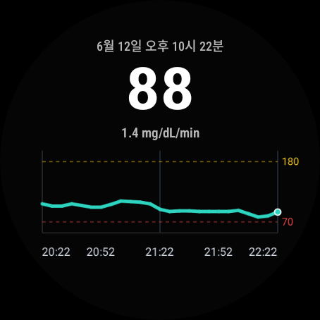
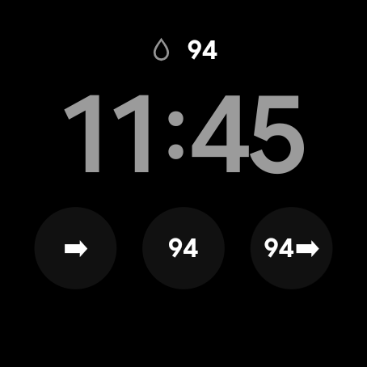

<div align="center">
  

  <h1>Glance</h1>

  <h3>Wear OS 스마트워치에서 혈당 데이터를 빠르게 확인할 수 있는<br/>오픈소스 혈당 모니터링 애플리케이션</h3>

</div>

<div align="center">

|                                                    QR 설정                                                     |                                                      메인 그래프                                                      |                                                        워치 페이스                                                        |
| :------------------------------------------------------------------------------------------------------------: | :-------------------------------------------------------------------------------------------------------------------: | :-----------------------------------------------------------------------------------------------------------------------: |
|  |  |  |

</div>

---

## Glance 소개

Glance는 Wear OS 스마트워치에서 혈당 데이터를 빠르게 확인할 수 있도록 만든 앱입니다.

**Dexcom Share**, **Nightscout**, **xDrip+ Sync**를 지원하며, 스마트폰 앱에 의존해 데이터를 중계받는 방식이 아니라 워치가 인터넷을 통해 직접 혈당 데이터를 수신합니다.

현재 혈당값, 추세, 변화량, 최근 그래프를 워치 앱과 워치 페이스 컴플리케이션에서 확인할 수 있습니다.

QR 기반 설정을 통해 워치에서 직접 복잡한 정보를 입력하지 않고 사용할 수 있습니다.

> Glance는 혈당 데이터를 더 쉽게 확인하기 위한 보조 도구이며, 의료적 판단이나 치료 결정은 공식 CGM 앱, 의료기기, 의료진의 안내를 기준으로 해 주세요.

## APK 설치

최신 APK 파일은 [GitHub Releases](https://github.com/taejeong1126/glance/releases/latest)에서 다운로드할 수 있습니다.

다운로드한 APK 파일은 ADB를 사용해 Wear OS 스마트워치에 설치할 수 있습니다.

## 개발 환경에서 실행

**요구사항**: Node.js ≥ 22, Yarn ≥ 4, Android Studio, Wear OS Emulator 또는 Wear OS 실기기

```sh
git clone https://github.com/taejeong1126/glance.git
cd glance
yarn install
yarn android
```

## 기여하기

Glance는 오픈소스 프로젝트이며, 모든 기여를 환영합니다.

버그 제보, 개선 아이디어, 기능 제안, 문서 수정, 코드 개선 등 어떤 형태의 기여도 좋습니다.
GitHub Issues 또는 Pull Request를 통해 자유롭게 참여해 주세요.

개인적인 문의는 `taejeong654@gmail.com`으로 연락해 주세요.

-   Issues: [GitHub Issues](https://github.com/taejeong1126/glance/issues)
-   Pull Requests: [GitHub Pull Requests](https://github.com/taejeong1126/glance/pulls)

## 라이선스

Glance는 **GNU General Public License v3.0**에 따라 배포됩니다.

라이선스 전문은 [LICENSE](./LICENSE) 파일에서 확인할 수 있습니다.
