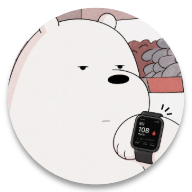

<div align="center">
  

  <h1>Glance</h1>

  <p>
    Wear OS 스마트워치에서 Dexcom, Nightscout, xDrip+ 혈당 데이터를<br/>
    빠르게 확인할 수 있는 혈당 모니터링 애플리케이션
  </p>
</div>

---

## 주요 기능

-   현재 혈당 수치 표시
-   혈당 추세 표시
-   변화량(Delta) 표시
-   최근 혈당 그래프 표시
-   Dexcom 연동
-   Nightscout 연동
-   xDrip+ Sync 연동
-   QR 기반 설정 플로우
-   Watch Face Complication 지원

## 지원 소스

-   **Dexcom**
-   **Nightscout**
-   **xDrip+ Sync**

> xDrip+ Sync는 소켓 통신 기반으로 동작하며,  
> Dexcom Share / Nightscout 방식과 동작 특성이 다를 수 있습니다.

## 시작하기

### 필수 환경

-   [Node.js](https://nodejs.org/) — `v22.11.0` 이상
-   [Yarn](https://yarnpkg.com/) — 프로젝트 기본 패키지 관리자
-   Android Studio
-   Wear OS Emulator 또는 Wear OS 실기기

### 저장소 복제

```sh
git clone https://github.com/taejeong-labs/glance.git
cd glance
```

### 의존성 설치

```sh
yarn install
```

## 실행 방법

### Android 실행

```sh
yarn android
```

> Wear OS 에뮬레이터 또는 연결된 워치가 필요합니다.

## 워치 표시 정보

-   현재 혈당 값
-   추세 화살표
-   분당 변화량
-   최근 혈당 그래프
-   Complication용 혈당 값 / 추세 / 게이지

## 피드백

버그 제보, 개선 아이디어, 기능 제안은  
GitHub Issues 또는 PR로 남겨주세요.

## 라이선스

GNU General Public License v3.0
